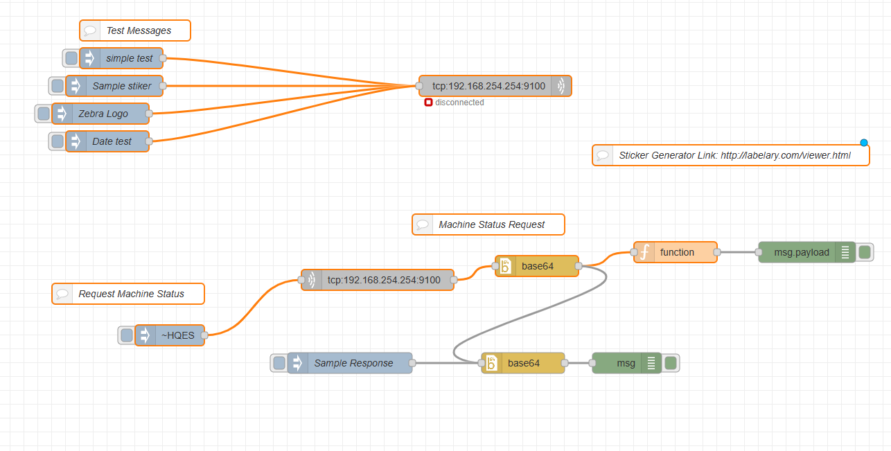

# NodeRed controler to set stickers in Zebra Printer

This is a small example to send tcp/ip comands to a zebra printer and output stickers with the given automation commans.

This was made with Node-Red but the same basic principles can be applied to other platform/stack.

Just inport the flow to Node-Red and setup the printer IP.

The stikers can be generated in several web tools available online.e.g.:

### Note: This was tested with a Zebra ZT411.
